  

  
  
  
  

 

<h3 align="center">Architecting Scalable Mobile Platforms & Resilient Backend Systems</h3>

  I am a Senior Software Engineer specializing in cross-platform mobile development and backend system architecture. I engineer end-to-end solutions from designing highly asynchronous Python backends and offline-first data synchronization layers, to crafting clean, responsive, Material-driven frontends. With a track record of owning products that serve <b>100,000+ users globally</b>, my recent work heavily involves complex biometric data pipelines for wearable tech, secure fintech infrastructure, and mentoring engineering teams to elevate code quality and system reliability.

 

### 🛠️ Tech Arsenal

  
<b>📱 Mobile & Frontend Engineering</b>

   
  
  
  
  
  
  
  
  

  
<b>☁️ Backend & Data Engineering</b>

   
  
  
  
  
  
  

  
<b>⚙️ DevOps, Architecture & Leadership</b>

   
  
  
  
  
  
  
  

 

### 🚀 Featured Engineering

> **[Pesa Radar](#)** ── *Fintech, Offline-First Architecture & Data Security*
>  
> Architected an offline-first finance tracker utilizing Clean Architecture, pairing Hive for local storage with Firestore for cloud synchronization. Engineered a custom named-group regex engine capable of parsing highly unstructured SMS alerts into structured, real-time transaction data. Implemented SHA-256 checksum-verified, chunked cloud backups to securely bypass platform document-size limits, alongside optimized UI elements for dynamic recipient analytics and active filtering.

> **[Smart Running](#)** ── *Wearable Tech, Data Pipelines & Compliance*
>  
> Engineered robust backend data synchronization pipelines and multi-step onboarding flows utilizing BLoC and go_router. Integrated the Terra V2 API and Health package to reliably ingest and process complex biometric data from Garmin, Coros, and Suunto devices. Successfully navigated complex App Store compliance and actively managed pre-release staging builds and backend workout sync flows via Firebase App Distribution.

> **[MyBlueprint](#)** ── *Productivity, Release Engineering & Scale*
>  
> Cross-platform habit and goal-tracking application currently live on iOS and Android, serving an active user base of **30,000+**. Architected for high scalability utilizing a Node.js and Firebase backend. Streamlined the product lifecycle by managing automated builds via Xcode Cloud and leveraging TestFlight for rigorous crash data monitoring and version deployments.

> **[Farmbetter](#)** ── *Agri-Tech, Distributed System Design & Global Reach*
>  
> Architected a highly resilient ecosystem connecting **100,000+ farmers and extension agents** spanning 10+ countries. Unified a Flutter mobile application, an Angular web platform, and a scalable GraphQL/Firebase backend to deliver reliable, distributed technological solutions at a global scale.

 

### 💼 Experience & Leadership

<ul>
  <li>
    <b>Senior Full-Stack Engineer</b> @ <b>ITalanta / Elewa</b> ── <i>(Jan 2022 — Present)</i> 
    Architecting multi-platform applications, leading deployment pipelines, and mentoring engineering teams for products serving 100,000+ active users.
  </li>
   
  <li>
    <b>Full-Stack Engineer</b> @ <b>Savanna Dot Net</b> ── <i>(Sep 2021 — Jan 2022)</i> 
    Developed native Android applications and integrated blockchain and fintech features into scalable web platforms.
  </li>
   
  <li>
    <b>Full-Stack Engineer</b> @ <b>Techxers Kenya Ltd</b> ── <i>(Jan 2020 — Aug 2021)</i> 
    Delivered production web and mobile applications across multiple client projects while mentoring a team of junior developers on technical delivery.
  </li>
   
  <li>
    <b>Co-Founder & Lead Developer</b> @ <b>Creators Galaxy Inc</b> ── <i>(Nov 2019 — 2022)</i> 
    Built the backend engine and led end-to-end development for mobile gaming titles utilizing C#, Unity, and SQLite.
  </li>
</ul>

 

  
  

 

  <b>Let's connect!</b> Open to talking Flutter offline-first architecture, fintech infra, how to sync wearable data without losing your mind, DIY hardware projects, or debating why Material Icons strictly beat Cupertino. When I'm not coding, you can probably find me plotting my next move in <i>Sid Meier's Civilization </i> or <i>Age of Empires 🐎</i>.

